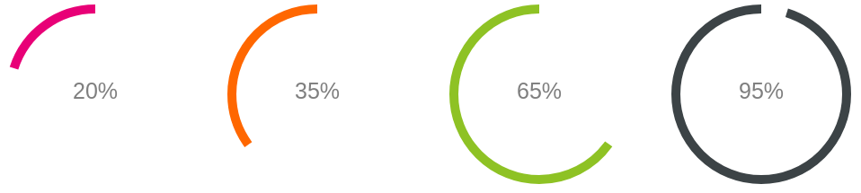

# Angular Radial Progress

A simple radial progress component for Angular. Responsive and highly customizable. 

## Installation

Run 
```bash
npm i angular-radial-progress --save-dev
``` 
to install.

Import in your Angular `AppModule` like:
```typescript
// Import radial-progress
import {RadialProgressModule} from "angular-radial-progress";

@NgModule({
  declarations: [
    AppComponent
  ],
  imports: [
    BrowserModule,
    RadialProgressModule // Import RadialProgressModule here

  ],
  providers: [],
  bootstrap: [AppComponent]
})
export class AppModule {}
```

Use it in your Angular application like:
```xml
<radial-progress
  [percent]="85"
  [circleSize]="250"
  [title]="'Title goes here'"
></radial-progress>
```

## Options

Option | Type | Default | Description
--- | --- | --- | ---
addClass | `string` | '' | add custom class(es) to component
animation | `boolean` | true | whether to animate drawing of outer circle or not
circleSize | `number` | 0 | size of circle. If `0` the circle is scaled relative to parent
clockwise | `boolean` |  false | whether to rotate clockwise or counter-clockwise
delay | `number` | 0 | delay drawing of outer circle (in ms)
fill | `string` | 'transparent' | color of fill of outer circle. Pass any color values you want
fillBackground | `string` | 'transparent' | color of fill of inner circle. Pass any color values you want
percent | `number` | 50 | number of percent
percentUnit | `string` | '%' | unit after percentage counter
showPercent | `boolean` | true | whether to show (percentage) counter or not
strokeBackground | `string` | 'transparent' | color of inner stroke. Pass any color values you want
strokeLinecap | `string` | 'butt' | stroke linecap of outer circle. Possible values: 'butt', 'round', 'square', 'inherit'
strokeSteps | `array` | [{strokeColor: 'red',strokeStep: 10}, {strokeColor: 'green',strokeStep: 100}] | array with json object(s). Only relevant if `animation == true`
strokeSteps.strokeColor | `string` | ['red', 'green'] | color of outer circle until current step. Pass any color values you want. Only relevant if `animation == true`
strokeSteps.strokeStep | `number` | [10, 100] | defines color to given percentage value. Make sure to define `strokeColor` for `strokeStep == 100`. Only relevant if `animation == true`
strokeWidth | `number` | 10 | width of outer circle stroke
strokeWidthBackground | `number` | 10 | width of inner circle stroke
title | `string` | '' | text to display. Leave empty to hide
transitionDuration | `number` | 5000 | time to draw outer circle to 100% (in ms). Only relevant if `animation == true`

## How stroke steps work

As mentioned in the options, there is one option `strokeSteps`. In here, you can define multiple intervals for your radial progress.

For example
```xml
   <radial-progress
     [percent]="85"
     [strokeSteps]="[{
        strokeColor: 'red',
        strokeStep: 25
     }, {
        strokeColor: '#FF0',
        strokeStep: 50
     }, {
        strokeColor: 'rgb(0, 0, 255)',
        strokeStep: 75
     }, {
        strokeColor: 'rgba(0, 255, 255, .4)',
        strokeStep: 100
     }
     ]"
   ></radial-progress>
```
will result in something like this

depending on the given percentage. That means:
- color = `red` for percentage interval between 0 - 24
- color = `#FF0` for percentage interval between 25 - 49
- color = `rgb(0, 0, 255)` for percentage interval between 50 - 74
- color = `rgba(0, 255, 255, .4)` for percentage interval between 75 - 100

**NOTE**: If you want only one single color, define strokeSteps like this:
```xml
   <radial-progress
     [strokeSteps]="[{
        strokeColor: 'red',
        strokeStep: 100
     }
     ]"
   ></radial-progress>
```
